<!--
  Profile README — rice edition.
  Repo:  AaronWard/AaronWard   (a repo named after your username = profile README)
  Files: README.md  +  rice-banner.svg   (both at repo root)
-->

<div align="center">
  <picture>
    <source media="(prefers-color-scheme: dark)" srcset="./rice-banner-dark.svg">
    <source media="(prefers-color-scheme: light)" srcset="./rice-banner-light.svg">
    
  </picture>
</div>

<br>

```console
aaronward@github ~ $ ls -1 ~/projects --sort=stars
```

| | | |
|:--|:--|:--|
| **[generative-ai-workbook](https://github.com/AaronWard/generative-ai-workbook)** | central repository for all LLM development | `jupyter` |
| **[covidify](https://github.com/AaronWard/covidify)** | corona virus report + dataset generator — archived | `jupyter` |
| **[scrapify](https://github.com/AaronWard/scrapify)** | multi-domain web scraping tool | `python` |
| **[time-series-analysis](https://github.com/AaronWard/time-series-analysis)** | experiments with time series data | `jupyter` |
| **[fastapi-model-deployment](https://github.com/AaronWard/fastapi-model-deployment)** | serving models behind FastAPI | `python` |
| **[certificates](https://github.com/AaronWard/certificates)** | receipts for the online learning | `—` |
