<!--
  Profile README — rice edition.
  Repo:  AaronWard/AaronWard   (a repo named after your username = profile README)
  Files: README.md  +  rice-banner.svg   (both at repo root)
-->

<div align="center">
  
</div>

<br>

```console
aaronward@github ~ $ ls -1 ~/projects --sort=stars
```

| | | |
|:--|:--|:--|
| **[generative-ai-workbook](https://github.com/AaronWard/generative-ai-workbook)** | central repository for all LLM development | `jupyter` |
| **[covidify](https://github.com/AaronWard/covidify)** | corona virus report + dataset generator — archived | `jupyter` |
| **[scrapify](https://github.com/AaronWard/scrapify)** | multi-domain web scraping tool | `python` |
| **[time-series-analysis](https://github.com/AaronWard/time-series-analysis)** | experiments with time series data | `jupyter` |
| **[fastapi-model-deployment](https://github.com/AaronWard/fastapi-model-deployment)** | serving models behind FastAPI | `python` |
| **[certificates](https://github.com/AaronWard/certificates)** | receipts for the online learning | `—` |

<br>

```console
aaronward@github ~ $ cat /etc/stack
```

<p>
  
  
  
  
  
  
  
  
</p>

<br>

```console
aaronward@github ~ $ systemctl status --user
```


<br>

```console
aaronward@github ~ $ whois --contact
```

[`github`](https://github.com/AaronWard) · [`linkedin`](https://linkedin.com/in/) · [`site`](https://) · [`mail`](mailto:)

<sub>`░▒▓` wallpaper, palette and dotfiles all lie. the commits don't. `▓▒░`</sub>
